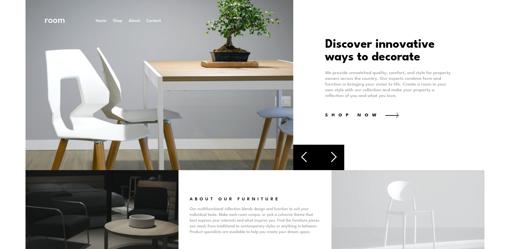

# Frontend Mentor - Room homepage solution

This is a solution to the [Room homepage challenge on Frontend Mentor](https://www.frontendmentor.io/challenges/room-homepage-BtdBY_ENq). Frontend Mentor challenges help you improve your coding skills by building realistic projects.

## Table of contents

- [Overview](#overview)
  - [The challenge](#the-challenge)
  - [Screenshot](#screenshot)
  - [Links](#links)
- [My process](#my-process)
  - [Built with](#built-with)
- [Author](#author)

## Overview

### The challenge

Users should be able to:

- View the optimal layout for the site depending on their device's screen size
- See hover states for all interactive elements on the page
- Navigate the slider using either their mouse/trackpad or keyboard

### Screenshot

### Links

- Solution URL: [AGitHub](https://github.com/jaac97/room-homepage-master)
- Live Site URL: [GitHub Pages](https://jaac97.github.io/room-homepage-master/)

## My process

### Built with

- BEM
- SASS and GULP
- CSS custom properties
- Flexbox and Grid
- Mobile-first workflow
- JavaScript Vainilla

## Author

- LinkedIn - [Josué Alarcón Camino](https://www.linkedin.com/in/josue-alarcon-camino/)
- Frontend Mentor - [@jaac97](https://www.frontendmentor.io/profile/jaac97)
